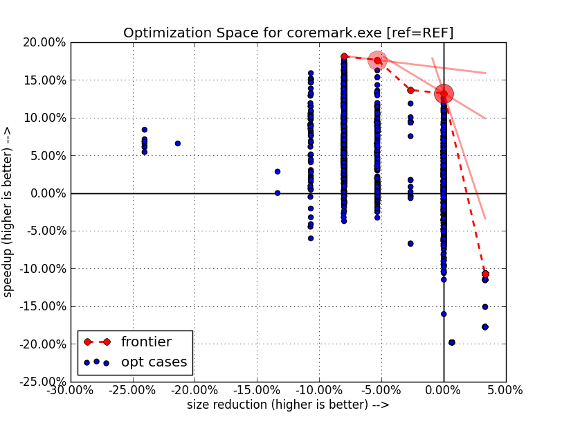

================
Example coremark
================

Executive Summary
-----------------
When first exploring a benchmark, as described in the tutorial, it may be interesting to
run explorations in several steps in order to get refined results at each stage.

Generally a good approach is to go through the following steps::

    atos-explore: basic exploration on the whole program,
    atos-explore-staged: advanced exploration on the whole program,
    atos-explore-acf --file-by-file: advanced file by file exploration on hot files,
    atos-explore-acf: advanced exploration function by function on hot functions.

The next section describes the steps and results obtained on the coremark v1.0 benchmark
on ST40/OS21 target with a HDK7108 board.

For this experiment, only the explore-staged (i.e. global options settings on
all files was experimented).

The results obtained on this configuration compared to the standard build configuration
(-O2 -flto -mrelax -fbranch-probabilities) are:

- Best performance tradeoffs, 17.63% speedup, 5.34% code size increase::

    speedup | sizered |       target |                       variant_id
    +17.63% |  -5.34% | coremark.exe | 57eda65a5010df53f666c3aa2c85ca92

- Best size tradeoffs, 13.21% speedup, 0.00% size reduction::

    speedup | sizered |       target |                       variant_id
    +13.21% |  +0.00% | coremark.exe | ea4063e6ca22c363f01d3307a113a6d4

Remaining Work
--------------
The exploration file by file and function by function should be run. This
example shows only a basic exploration where flags are applied to the whole
application.

Though currently, there is no support in ATOS tools 2.0 for PC-sampling
based profiling on OS21. The support of -pg option for generating profile will
be added in a future version.

In between it should be possible to run the fine grain exploration with an
explicit list of hot files given by the user. This facility could also be
added to future ATOS tools version.

Build and Run Scripts
---------------------
The build system for the coremark benchmark as some pitfalls which requires
caution when auditing with the ATOS tools.

For instance, when building in SEPARATE_COMPILE mode, the clean target does
not correctly remove all files, hence it is better to use a build script such
as the following::

    $ cat build-atos
    #!/usr/bin/env bash
    set -e
    rm -f *.exe *.o
    make ROOT=.../superh_elf/4.7_ref/build/image SEPARATE_COMPILE=1 PORT_DIR=st40 ITERATIONS=2000 REBUILD=1 clean coremark.exe
    $ chmod 755 build-atos

For the run part, the makefile contains a target for running the benchmark but
the executable always exit with code 0 even in case of error. Also, as the run
target depends upon the built executable, in case of clock skew, the benchmark
may be recompiled, discarding any optimization made by the ATOS tools. A
secure run script is given below::

    $ cat run-atos
    #!/usr/bin/env bash
    set -e
    [ -f coremark.exe ] || exit 1
    touch coremark.exe # ensure no rebuild
    make PORT_DIR=st40 ITERATIONS=2000 run1.log
    cat run1.log
    errors=`grep "ERROR" run1.log| grep -v "Must execute for at least"| wc -l`
    [ "$errors" = 0 ] || exit 1
    time=`awk '{ if (/Total ticks/) { print $4 } }' < run1.log`
    echo user $time

Exploration on coremark v1.0
----------------------------

The experiment was run with atos version 2.0-54-g2bfc481c.

The script for reproducing the experiment can be obtained and run with::

    $ grep '    $sh' $PREFIX/share/atos/doc/example-coremark.rst >example-coremark.sh
    $ sh example-coremark.sh

Setup the path to the ATOS tools and to your sh4gcc/OS21 compiler.
Below is the setup used for this experiment::

    $sh set -ex
    $sh atos -v
    atos version 2.0-54-g2bfc481c
    $sh sh4gcc --version
    sh4gcc (Base - Revision 3416) 4.7.2 20121106
    $sh hostname -f && lsb_release -ri
    hostname
    Distributor ID: RedHatEnterpriseClient
    Release:        5.4

First initialize the ATOS session::

    $sh atos init -c -b ./build-atos -r ./run-atos -e coremark.exe

Then run a first basic exploration::

    $sh atos explore --cookie coremark-1 --cookie base
    $sh atos-play -T -s 5 -s 1 -s 0.2 --cookie base
    speedup | sizered |       target |                       variant_id
     +8.16% |  -5.34% | coremark.exe | 762ac1219b2c148b1124ef2354236d14
    -11.52% |  +3.32% | coremark.exe | dffc8f4cd610ab6c46c19ec0d059ce29

Note that in this example we use the --cookie options for easing the retrieval
of results at each stage of the experiment. These options are not necessary
otherwise.

Run a first staged exploration with::

    $sh atos explore-staged --cookie coremark-1 --cookie staged100
    $sh atos-play -T -s 5 -s 1 -s 0.2 --cookie staged100
    speedup | sizered |       target |                       variant_id
    +17.55% |  -8.01% | coremark.exe | 9a1a202fb1ce1ef57b31a325cdfd4caa
    +13.21% |  +0.00% | coremark.exe | ea4063e6ca22c363f01d3307a113a6d4

Run a more extensive staged exploration (500 basic iterations) with::

    $sh atos explore-staged --cookie coremark-1 --cookie staged500 -M500
    $sh atos-play -T -s 5 -s 1 -s 0.2 --cookie staged500
    speedup | sizered |       target |                       variant_id
    +18.10% |  -8.01% | coremark.exe | a694a7b933e17c732ce8fdbf3c00fab9
    +12.57% |  -0.03% | coremark.exe | 179a0c2ceb887ab892e2743591e8e701

To get the global best perf/size tradeoffs over all runs, do::

    $sh atos-play -T -s 5 -s 1 -s 0.2 --cookie coremark-1
    speedup | sizered |       target |                       variant_id
    +17.63% |  -5.34% | coremark.exe | 57eda65a5010df53f666c3aa2c85ca92
    +13.21% |  +0.00% | coremark.exe | ea4063e6ca22c363f01d3307a113a6d4

The resulting exploration space graph is shown below:

Note that for the size axis, the staged effect is due to the sh4 embedded
toolchain that aligns and pads program size to multiple of page sizes (4096
bytes in this case).
