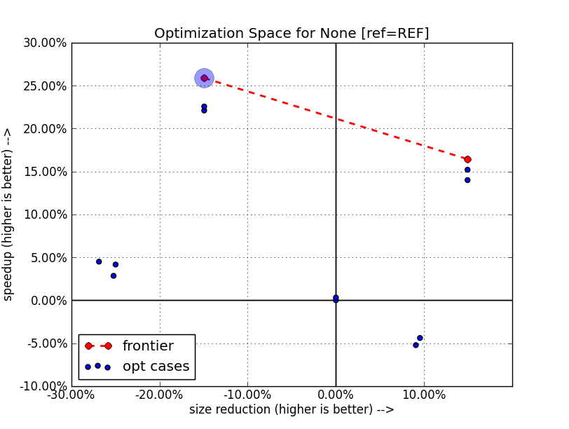
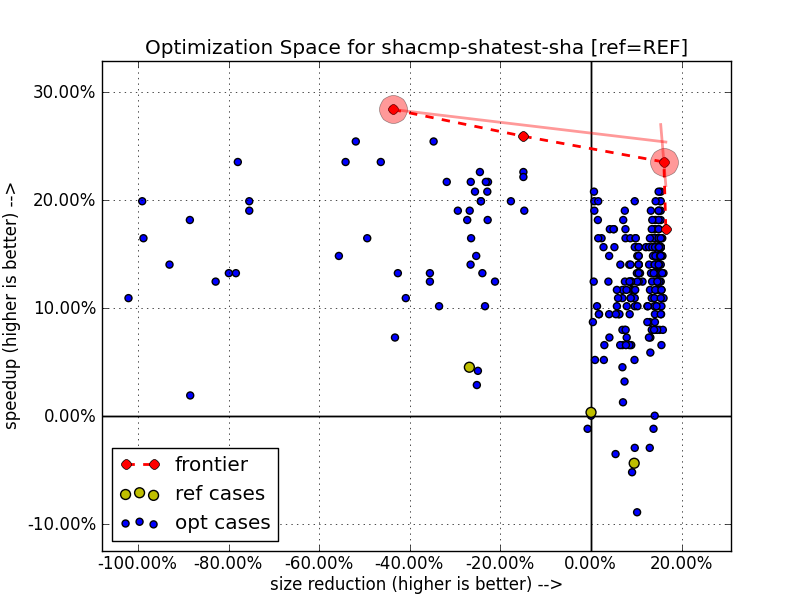

=============
ATOS Tutorial
=============

Requirements
-------------
The following requirements must be met on the host machine where the ATOS
tools will be installed:

- Linux machine with kernel 2.6.9 or greater,
- Python 2.6.x or greater,
- Python pylab modules for the ``atos-graph`` tool:

  - python-matplotlib: http://www.scipy.org/PyLab or from your package
    manager python-matplotlib
  - python-matplotlib-tk:  http://www.scipy.org/PyLab or from your package
    manager python-matplotlib-tk

Installation
------------
Install the ATOS tools by unarchiving the binary release into a local
directory, then set your ``PATH`` to point to the ``atos-x.y.z/bin`` directory.
For instance:

::

  $ tar xvzf atos-1.0.0.tgz
  $ export PATH=$PWD/atos-1.0.O/bin:$PATH
  $ atos-explore -v
  atos-explore version 1.0.0

First Exploration
-----------------
Run a first exploration for a host program, for example the SHA1 C++
implementation that can be found in ``atos-x.y.z/share/atos/examples/sha1``:

::

  $ cd share/atos/examples/sha1
  $ atos-explore -b "make clean all" -r "./run.sh"
  $ atos-play -p -f time	# prints performance first tradeoff
  ATOS: shatest-shacmp-sha-shared-sha-sha.so: OPT-Os-flto-funroll-loops: version: 1.0.0
  ATOS: shatest-shacmp-sha-shared-sha-sha.so: OPT-Os-flto-funroll-loops: -Os -flto -funroll-loops
  ATOS: shatest-shacmp-sha-shared-sha-sha.so: OPT-Os-flto-funroll-loops: size: 26163
  ATOS: shatest-shacmp-sha-shared-sha-sha.so: OPT-Os-flto-funroll-loops: time: 150.0
  $ atos-play -p -f size	# prints code size first tradeoff
  ATOS: shatest-shacmp-sha-shared-sha-sha.so: OPT-Os-flto-funroll-loops: version: 1.0.0
  ATOS: shatest-shacmp-sha-shared-sha-sha.so: OPT-Os-flto-funroll-loops: -Os -flto -funroll-loops
  ATOS: shatest-shacmp-sha-shared-sha-sha.so: OPT-Os-flto-funroll-loops: size: 26163
  ATOS: shatest-shacmp-sha-shared-sha-sha.so: OPT-Os-flto-funroll-loops: time: 150.0
  $ atos-graph			# and select manually a preferred configuration id by clicking on the corresponding point
  $ atos-play -l e69f17ade7a5e5983109280f1f9c3731	# rebuilds the selected configuration

Depending on your compiler capabilities, the build configurations ran by
``atos-explore`` will be a combination of ``-O2/-Os/-O3``, feedback directed
optimizations and link time optimizations.

The ``-b`` option to ``atos-explore`` specifies a command line to execute for
building your program. Note that it is important that the build of all objects
files is observed by the tools, hence it is recommended to do a clean build,
in this example ``make clean all``.

The ``-r`` option to ``atos-explore`` specifies the run script that have to be
executed for actually running the program. The
default behavior of the tools when no more option is given is to do a ``time
-p`` on top of the run script, hence the run script just have to execute the
application with a representative dataset.

The ``atos-play`` tool can be used to print found configurations given an
objective criterion. With the ``-p`` option it prints out the variant, options
and timing/size results, by default selecting a performance first best
tradeoff (the ``-f time`` option is the default actually). If one wants a size
first best tradeoff, the ``-f time`` option must be used.

The ``atos-graph`` tool displays the code size and timing results for all
build configuration results. One can select the preferred code
size/performance tradeoff by clicking on the configuration point, the
``id`` identifier displayed can be used to uniquely identify the
configuration in the local results database.

Once a configuration has been chosen it can be rebuilt with the ``atos-play``
tool with the ``-l id`` option.

The resulting graph is show below:

The best configuration is the point on the top right of the figure which is
best in both code size and performance dimensions. It gives a speedup of 53.33%
with a code size reduction of 15.52% compared to the reference build.

In the example exploration above, the best performance and best size
configurations are the same. This is infrequent and fortunately it simplifies
the choice of the preferred configuration. To help this choice, the atos-graph
tool displays a frontier in red where all best points are highlighted such
that manual selection is simplified.

This first example exploration is mainly for the purpose of this
tutorial, indeed a number of improvements could be made for an actual
optimization of a host program as it is the case there:

- on a workstation the timing information is variable and thus the ``-n
  nb_runs`` option should probably be passed to ``atos-explore`` for running
  the executable several times and comparing the average timing result, do
  this with ``atos-explore -n 10 ...`` for instance,
- by default the timing is measured on the whole run script execution, it may
  be more accurate to instrument the sole optimized program from the run
  script itself,
- for a more accurate exploration, the QEMU emulation tool could be used
  instead of a direct execution, this has the advantage of giving stable
  timing results, and as will be shown latter in this tutorial it can be used
  to perform more sophisticated explorations based on the timings of each
  executed function, not only the whole program execution time.

Extensive Exploration
---------------------
The first level exploration illustrated in the previous section consists of
very high level options combinations. In order to explore more deeply the
potential of optimization of an application, one may want to activate a more
complete exploration which will trigger much more compiler options and will
use a finer grain approach for passing options.

Each time an exploration is initiated, the configuration and results database
are created into the local ``atos-configurations`` directory. If one wants to
backup a previous exploration or restart from the start, the directory can be
simply copied and erased. The results database can be also pushed to another
results database, but we will keep using the local databases in this tutorial.

Thus, for starting a new experiment on the SHA1 C++ example, do:

::

  $ cp -a atos-configurations atos-configurations-first
  $ rm -rf atos-configurations
  $ atos-init -b "make clean all" -r "run.sh"

In this case, the initialization was done explicitly with the ``atos-init``
tool, which was implicitly called in the previous section by the basic
``atos-explore`` tool.

From this point, we can try several exploration kinds, for instance:

::

  $ atos-explore

This runs again the first level exploration from the just initialized
environment. Then:

::

  $ atos-explore-inline -M 50

This runs the exploration of inlining, which is generally efficient at finding
good performance/size tradeoffs. The number of configurations to run is passed
with the ``-M`` option, the default is 100.

::

  $ atos-explore-loop -M 50

This runs exploration of loop related options, which generally will find
better performance results, but can also find better size tradeoffs.

::

  $ atos-explore-optim -M 50

This runs the exploration of other compiler flags and parameters, for instance
scheduling flags or register allocation parameters.

Note that, at any time, one can observe the current results database with
``atos-graph``, optionally the database can be observed while the explorations
are running with:

::

  $ atos-graph --follow

Alternatively, one can extract as previously the best performance
tradeoff with:

::

  $ atos-play -P
  OPT-O3-fno-gcse-after-reload-fcrossjumping-fno-dce-fno-dse-fira-share-save-slots-fdelayed-branch-fschedule-insns-fno-schedule-insns2-fno-sched-interblock-fsched-spec-fno-sched-spec-load-dangerous-fsched-stalled-insns-dep-fno-selective-scheduling2-fno-sel-sched-pipelining-outer-loops-fconserve-stack-ftree-copy-prop-fno-ipa-cp-fno-ipa-matrix-reorg-fno-tree-switch-conversion-fno-tree-dominator-opts-ftree-ch-fno-tree-copyrename-fno-tree-ter-ftracer-fno-align-functions-fno-toplevel-reorder-fweb-freciprocal-math-frename-registers-fno-sched-pressure-fsched-group-heuristic-fno-sched-critical-path-heuristic-fno-sched-rank-heuristic-fno-tree-pta-ftree-phiprop-ffp-contract=off-fno-combine-stack-adjustments-fno-compare-elim-freorder-blocks-and-partition-fforward-propagate-fno-auto-inc-dec-fno-thread-jumps-fcse-skip-blocks-fno-gcse-fno-gcse-lm-fno-gcse-sm--parammin-crossjump-insns=2--paramhot-bb-frequency-fraction=8761--paramtracer-dynamic-coverage-feedback=79--paramtracer-max-code-growth=185--paramtracer-min-branch-ratio=63--parammax-sched-extend-regions-iters=1--parammax-sched-insn-conflict-delay=6--paramdevirt-type-list-size=26

Note that in the later example, the ``-P`` option was used for outputting only
the variant name.

After these four kind of exploration, one should get a set of configuration
which is interesting for having an idea of the potential for optimization of
an application, though this is not yet ideal, in particular:

- the different explorations are not linked together, we will see later how to
  benefit from previous explorations for starting a new one,
- the configuration is still applied globally on all the compiled objects, we
  will see later how to inject configuration on a function per function basis
  for finer grain optimization.

Staged Exploration
------------------
In the previous section, we have seen how to run some common exploration
scenario, though there was no configuration generated that combine for
instance inlining options with unrolling options. In order to achieve this,
the different explorations must be staged by passing at each step a set of
preferred points from which the new exploration will start. For instance,
if one restarts from the current exploration status (note that this may give
different results compared to restarting from an empty results database, but
it is not an issue to accumulate explorations, even redundant ones):

::

  $ atos-explore-inline -M 50 `atos-play -s 5 -s 1 -s 0.2 -P`

The ``atos-play -s 5 -s 1 -s 0.2 -P`` command will output the three
configurations that correspond to the given tradeoffs (``-s`` options). These
configurations will be used for the exploration, summing to a total of 150
additional builds/runs.

The ``-s`` option is used to determine a tradeoff by giving a performance/size
benefit ratio, i.e. for instance:

- ``-s 5`` means that one will favor performance 5 times more than size, said
  otherwise a point is likely to be selected in place of the overall best
  performance point if its speedup is at least 5 times larger than
  its code size reduction,
- ``-s 1`` means that speedup and code size reduction are equally considered,
- ``-s 0.2`` means that code size reduction is favored and weights 5 times
  more than speedup in the selection process.

After the previous exploration of inlining options on the 3 common tradeoffs
(best performance, equal performance/size and best size) one can observe the
newly generated 3 common tradeoffs configurations, for instance with:

::

  $ atos-play -P -s 5 -s 1 -s 0.2
  OPT-O3-fno-gcse-after-reload-fcrossjumping-fno-dce-fno-dse-fira-share-save-slots-fdelayed-branch-fschedule-insns-fno-schedule-insns2-fno-sched-interblock-fsched-spec-fno-sched-spec-load-dangerous-fsched-stalled-insns-dep-fno-selective-scheduling2-fno-sel-sched-pipelining-outer-loops-fconserve-stack-ftree-copy-prop-fno-ipa-cp-fno-ipa-matrix-reorg-fno-tree-switch-conversion-fno-tree-dominator-opts-ftree-ch-fno-tree-copyrename-fno-tree-ter-ftracer-fno-align-functions-fno-toplevel-reorder-fweb-freciprocal-math-frename-registers-fno-sched-pressure-fsched-group-heuristic-fno-sched-critical-path-heuristic-fno-sched-rank-heuristic-fno-tree-pta-ftree-phiprop-ffp-contract=off-fno-combine-stack-adjustments-fno-compare-elim-freorder-blocks-and-partition-fforward-propagate-fno-auto-inc-dec-fno-thread-jumps-fcse-skip-blocks-fno-gcse-fno-gcse-lm-fno-gcse-sm--parammin-crossjump-insns=2--paramhot-bb-frequency-fraction=8761--paramtracer-dynamic-coverage-feedback=79--paramtracer-max-code-growth=185--paramtracer-min-branch-ratio=63--parammax-sched-extend-regions-iters=1--parammax-sched-insn-conflict-delay=6--paramdevirt-type-list-size=26
  OPT-Os-funroll-loops--parammax-inline-insns-auto=195--paraminline-unit-growth=41--parammax-inline-recursive-depth-auto=4--parammax-inline-insns-recursive=396--parammax-inline-insns-recursive-auto=395-fno-partial-inlining-fno-indirect-inlining-finline-small-functions--paramlarge-stack-frame-growth=1885-flto
  OPT-Os-funroll-loops--parammax-inline-insns-single=796--paraminline-unit-growth=31--parammax-inline-recursive-depth=7--parammax-inline-recursive-depth-auto=13--parammax-inline-insns-recursive=919--parammax-inline-insns-recursive-auto=922--parampartial-inlining-entry-probability=65-fno-indirect-inlining-fno-inline-functions-finline-small-functions--paramlarge-stack-frame-growth=926-flto

Or with a graphical view:

::

   $ atos-graph -s 5 -s 1 -s 0.2

The exploration space shown on the graph will have the three selected
tradeoffs highlighted.

Up to this point, 320 configurations were run, 20 for the first level
exploration, 150 (50 * 3) for the 3 extensive explorations, and 150 more for
the re-exploration of inlining options on 3 common tradeoffs.

This process can be continued, by running the other extensive explorations, as
shown below:

::

  $ atos-explore-loop -M 50 `atos-play -P -s 5 -s 1 -s 0.2`

The later will explore loop optimizations on top of the three configurations
shown above with the ``atos-play`` command.

Again we can run on top of the results, the last extensive exploration with:

::

  $ atos-explore-optim -M 50 `atos-play -P -s 5 -s 1 -s 0.2`

The later will explore 150 more configurations.

At the end of this staged exploration, approximately 600 configurations will
have been explored, the resulting exploration space can be observed with:

::

  $ atos-graph -s 5 -s 1 -s 0.2 -H '^OPT-O[s23]$'

This command will highlight the three common tradeoffs and mark for reference
the selected points (the ``-H`` option is given a regexp, in this case the
Os/O2/O3 basic configurations).

The resulting graph is show in this figure:

One can notice that the
exploration found a point which is both the best performance tradeoff and the
best code size tradeoff. It gives, compared to the reference build, a speedup
of 76.92% and a code size reduction of 15.21%. This is much better than both
the ``-O3`` point at 27.78% speedup and the ``-Os`` point at 7.56% code size
reduction.

Note also, that the result is now better than the best point after the first
level exploration in term of speedup (76.92% compared to 53.33%) with a
negligible difference in term of size reduction (15.21% compared to 15.52%).

The configuration can then be rebuilt with for instance:

::

  $ atos-play -f time
  Playing optimized build shatest-shacmp-sha-shared-sha-sha.so:
  OPT-Os-funroll-loops--parammax-inline-insns-auto=195--paraminline-unit-growth=41--parammax-inline-recursive-depth-auto=4--parammax-inline-insns-recursive=396--parammax-inline-insns-recursive-auto=395-fno-partial-inlining-fno-indirect-inlining-finline-small-functions--paramlarge-stack-frame-growth=1885-fexpensive-optimizations-fsplit-ivs-in-unroller-fno-tree-vect-loop-version-fpredictive-commoning--parammax-average-unrolled-insns=631--paramlim-expensive=396--parammax-iterations-computation-cost=43--paramiv-consider-all-candidates-bound=24-fno-loop-block-fno-loop-interchange-fmove-loop-invariants-ftree-dce-fno-peel-loops-ftree-loop-distribution-ftree-loop-im-ftree-loop-ivcanon-ftree-vectorize-funroll-all-loops-fno-unswitch-loops-fno-prefetch-loop-arrays--parammin-vect-loop-bound=741-fgcse-sm-fgcse-after-reload-fno-dce-fdse-fno-if-conversion2-fno-ira-share-save-slots-fdelayed-branch-fsched-spec-load-dangerous-fno-sched-stalled-insns-fno-sched-stalled-insns-dep-fno-selective-scheduling-fsel-sched-pipelining-fno-caller-saves-fno-conserve-stack-fipa-reference-fipa-cp-clone-fno-tree-ccp-ftree-builtin-call-dce-fno-tree-ch-fno-align-functions-falign-labels-falign-jumps-fcprop-registers-fno-float-store-fsingle-precision-constant-fbranch-target-load-optimize--parammax-crossjump-edges=301--parammin-crossjump-insns=2--parammax-sched-region-blocks=29--parammax-sched-region-insns=177--parammin-spec-prob=45--paramsched-spec-prob-cutoff=72--parammax-jump-thread-duplication-stmts=30-fipa-sra-fno-sched-group-heuristic-fsched-critical-path-heuristic-fsched-rank-heuristic-fsched-last-insn-heuristic-fno-sched-dep-count-heuristic-fno-tree-phiprop--paramipa-sra-ptr-growth-factor=1-ffp-contract=off-fno-devirtualize-fno-combine-stack-adjustments-fno-ipa-profile-fno-tree-bit-ccp-fno-tree-loop-distribute-patterns-fcompare-elim--parammax-gcse-insertion-ratio=41--paramgcse-unrestricted-cost=7-foptimize-sibling-calls-fno-auto-inc-dec-fno-modulo-sched-fmodulo-sched-allow-regmoves-fcse-skip-blocks-fgcse-flto...

While a staged exploration as demonstrated above is extensively using the
compiler options for finding application wide best tradeoffs, all options are
passed globally to the build system, thus there is no opportunity to improve
code size in part of the applications where performance is less
important. Also for complex applications there is no opportunity to improve
performance with specific options in a given module and different options in
another one.

We will see next how to do a finer grain exploration, in particular by
exploring the build configurations function per function.

Fine grain exploration
----------------------
In order to do fine grain exploration the compiler must be a GCC compiler >=
4.5 with support for plugins enabled. This feature will be detected by the
tool and used if available. An exploration on a file by file basis is also
possible, but this feature is not available yet in ATOS tools 1.0.x.

In addition to plugin support at compile time, the tool must be assisted at
run time in order to get profile information and identify functions which are
critical for performance (hot functions), and functions which do not
contribute to performance (cold functions).

This is not yet automated in the tools, hence one has to specify a specific
script to the configuration in order to retrieve ``oprofile`` like output
generated by the run script.

In order to use the oprofile tool for generating a profile, add to your run
script the ``opcontrol`` commands necessary for initializing, starting and
stopping oprofile. Then add a script for generating the oprofile report and
pass it to the ``atos-init`` tool.

For our SHA1 C++ example, the run script can for instance be modified like
this:

::

  $ cat run_oprofile.sh
  #!/usr/bin/env bash
  set -e
  cleanup() {
    sudo opcontrol --stop
    sudo opcontrol --shutdown
  }
  trap cleanup EXIT INT TERM QUIT
  sudo opcontrol --init
  sudo opcontrol --start-daemon --separate=lib,kernel --no-vmlinux
  sudo opcontrol --reset
  sudo opcontrol --start
  dd if=/dev/urandom bs=4K count=1K 2>/dev/null | /usr/bin/time -p ./sha
  exit ${PIPESTATUS[0]}

Note that in this setup opcontrol needs sudo privileges. Note also that the
timing for the application (``./sha`` there) has been included into the
script.

For retrieving the oprofile output, generally ``opreport`` can be used,
in this case demangling must be turned off and per application report must be
enabled, in our case the script is as follow:

::

  $ cat get_oprofile.sh
  #!/bin/sh
  exec opreport -l sha -w -D none

Once these scripts are ready, they can be tested for instance on the reference
configuration by doing:

::

  $ atos-play -r
  Playing optimized build shatest-shacmp-sha-shared-sha-sha.so:REF...
  Building variant REF...
  $ ./run_oprofile.sh
  Using default event: CPU_CLK_UNHALTED:100000:0:1:1
  Using 2.6+ OProfile kernel interface.
  Using log file /var/lib/oprofile/samples/oprofiled.log
  Daemon started.
  Signalling daemon... done
  Profiler running.
  49F9C561 887EECBC FD4BA2DE 12A9B965 F1DF688E - STDIN
  real 0.62
  user 0.26
  sys 0.00
  Stopping profiling.
  Killing daemon.
  $ ./get_oprofile.sh
  warning: /no-vmlinux could not be found.
  CPU: Intel Sandy Bridge microarchitecture, speed 1.601e+06 MHz (estimated)
  Counted CPU_CLK_UNHALTED events (Clock cycles when not halted) with a unit mask of 0x00 (No unit mask) count 100000
  vma      samples  %        image name               symbol name
  0006d430 1238     24.6123  libc-2.14.1.so           fgetc
  0006cc30 1091     21.6899  libc-2.14.1.so           feof
  00400d30 1017     20.2187  sha                      _ZN4SHA119ProcessMessageBlockEv
  00400f40 890      17.6938  sha                      _ZN4SHA15InputEPKhj
  00400940 353       7.0179  sha                      main
  00401050 314       6.2425  sha                      _ZN4SHA15InputEc
  00000000 109       2.1670  no-vmlinux               /no-vmlinux
  ...

The configuration can then be updated with for instance:

::

  $ atos-init -b "make clean all" -r ./run_oprofile.sh -p ./get_oprofile.sh -n 0

The ``-p`` option has been added to specify the script that will
output the profile information.

Note that the ``-n 0`` option has been specified such that the initial
reference configuration is not recorded again. This is useful for
changing the configuration without modifying the results database.

Once the profiling support is setup, an exploration can be executed with a
partitioning of the hot and cold functions with:

::

  $ atos-explore-acf

By default this tool will select the critical functions contributing to 70% of
the performance and execute an exploration on a function per function
basis. The other functions, considered cold are optimized for size first.

Full exploration
----------------
In the previous section, we've been doing a step by step exploration for
understanding the tools usage and discovering some useful options, though a
full staged exploration is available for launching basically all the above
steps in one single command.

If you've gone through the previous steps, backup your configuration and
results first with for instance:

::

  $ cp -a atos-configurations atos-configurations-staged
  $ rm -rf atos-configurations

Then do a a full staged exploration with:

::

  $ atos-explore-staged -M 50 -b "make clean all" -r ./run_oprofile.sh -p ./get_oprofile.sh

Note that this is equivalent to:

::

  $ atos-init -b "make clean all" -r ./run_oprofile.sh -p ./get_oprofile.sh
  $ atos-explore-staged -M 50

Emulation
---------
In previous sections, runs were done on the host machine and the results were
computed automatically by ATOS tools using the ``time -p`` command. This can
lead to unreliable results depending on the host machine state. Emulation
tools like QEMU can be used to address this issue.

The replacement of direct execution by emulation must be done by specifying a
specific run script. This script should call QEMU and output the timing
results in the same format as ``time -p``.

For the SHA1 C++ example, this run script might be:

::

  $ cat run_qemu.sh
  #!/usr/bin/env bash
  set -e
  tmpfile=`mktemp /tmp/run.XXXXXX`
  arch=`uname -m`
  case arch in i386|i586|i686) arch=i386 ;; esac
  dd if=/dev/urandom bs=4K count=1K 2>/dev/null | qemu-$arch -count-ifetch ./sha 2>$tmpfile
  [ ${PIPESTATUS[0]} = 0 ] || exit 1
  awk '{if ($1 == "qemu:") { print "user " $10 / 1000000000; }}' <$tmpfile

A full staged exploration can then be performed with:

::

  $ atos-explore-staged -M 50 -b "make clean all" -r ./run_qemu.sh

Cross compilation and remote execution
--------------------------------------
While examples from previous sections were all based on a native compilation
and execution process, it is also possible to use ATOS tools in a cross
compilation context.

For the build part there is nothing to change as long as the build
script, given to ATOS tools with the ``-b`` option, correctly handles
cross compilation.

For the run part, it is still possible to use QEMU for running and
getting the time results. ``PRoot`` can also be used in conjunction
with QEMU to run the binary in a given target root file system.

 ::

  $ cat build_arm.sh
  #!/usr/bin/env bash
  set -e
  arm-linux-androideabi-g++ -o sha -O2 -D_FILE_OFFSET_BITS=64 sha1.cpp sha.cpp

  $ cat run_qemu_arm.sh
  #!/usr/bin/env bash
  set -e
  tmpfile=`mktemp /tmp/run.XXXXXX`
  dd if=/dev/urandom bs=4K count=1K 2>/dev/null | \
  proot -w . -b $PWD -Q "qemu-$arch -count-ifetch" $ANDROIDROOTFS ./sha 2>$tmpfile
  [ ${PIPESTATUS[0]} = 0 ] || exit 1
  awk '{if ($1 == "qemu:") { print "user " $10 / 1000000000; }}' <$tmpfile

  $ atos-explore-staged -M 50 -b ./build_arm.sh -r ./run_qemu_arm.sh

One might also want to execute the program remotely, like on a board if
available.

In that case, additional options should be given to the ATOS tools.

- During the build, the ``-B`` option should be used to specify a
  directory on the target file system where profile files will be
  generated. These profile files are used for feedback directed
  optimizations. This ``-B`` option should be given to
  ``atos-explore`` and other ATOS exploration tools.

- For the execution part, the run script must take care of
  transferring the compiled program (and any other files necessary to
  the execution) to the board, connecting to the board and running the
  program.

- The run script must also transfer back the files generated during
  profiling execution. When environment variables LOCAL_PROFILE_DIR
  and REMOTE_PROFILE_DIR are set, files stored in directory
  $REMOTE_PROFILE_DIR on the remote host must be transferred to the
  directory $LOCAL_PROFILE_DIR on the local host.

Such a run script can look like:

::

  $ cat run_remote.sh
  #!/usr/bin/env bash
  set -e
  [ "$REMOTE_PROFILE_DIR" = "" ] || ssh /bin/rm remote_machine:$REMOTE_PROFILE_DIR/*
  scp sha remote_machine:/tmp/sha
  ssh remote_machine "/bin/dd if=/dev/urandom bs=4K count=1K 2>/dev/null | time -p /tmp/sha"
  [ ${PIPESTATUS[0]} = 0 ] || exit 1
  [ "$REMOTE_PROFILE_DIR" = "" ] || scp remote_machine:$REMOTE_PROFILE_DIR/* $LOCAL_PROFILE_DIR

A first level exploration could then be performed with:

::

  $ atos-explore -b "make clean all" -r ./run_remote.sh -B /tmp/profile

Custom script for results
-------------------------

Sometimes, sizing and timing results can not be automatically get by
ATOS tools just by applying the ``size`` command to built binaries and
reading the output of the run script. In such cases, one can provide a
script which will be used by ATOS tools after each run for getting
size and time results. Such result scripts can also be used for
considering separately several parts of the run. The output of this
script should be formatted like this:

::

  $ ./get_results.sh
  ATOS: sha1: time: 70.0
  ATOS: sha1: size: 23000
  ATOS: sha256: time: 100.0
  ATOS: sha256: size: 22000

This script must be specified to ATOS tools using the ``-t`` option,
for instance:

::

  $ atos-explore -b "make clean all" -r ./run.sh -t ./get_results.sh
